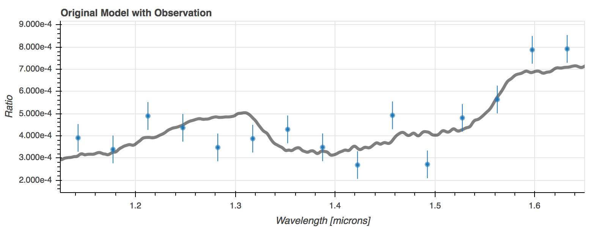
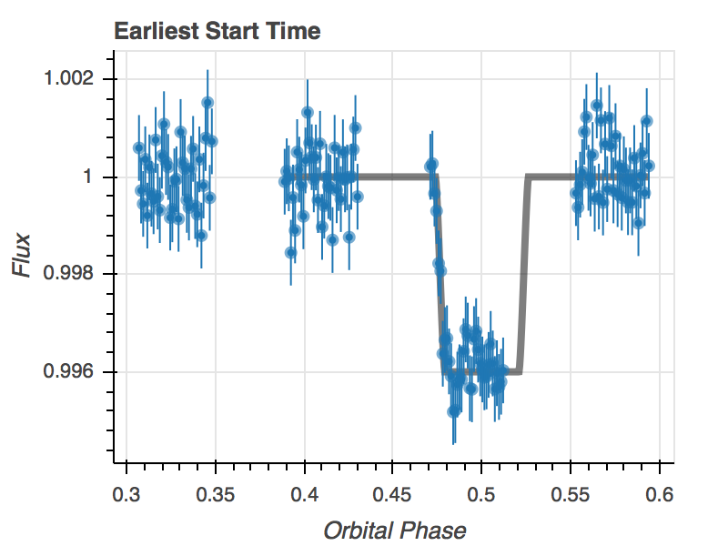
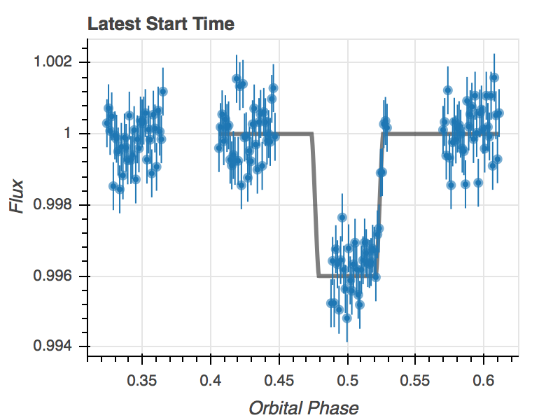

HST Tutorial 
===============

This file demonstrates how to use TExoNS to predict the: 1.
Transmission/emission spectrum S/N ratio 2. Observation start window for
any system observed with WFC3/IR.

.. code:: python
    
    import pandexo.engine.justdoit as jdi

Editting Input Dictionaries
---------------------------

Step 1) Load in a blank exoplanet dictionary
~~~~~~~~~~~~~~~~~~~~~~~~~~~~~~~~~~~~~~~~~~~~

.. code:: python

    exo_dict = jdi.load_exo_dict()

Edit stellar and planet inputs
^^^^^^^^^^^^^^^^^^^^^^^^^^^^^^

.. code:: python

    #WASP-43
    exo_dict['star']['mag']      = 9.397                # H magnitude of the system
    #WASP-43b
    exo_dict['planet']['type']    = 'user'               # user specified inputs
    exo_dict['planet']['exopath'] = 'WASP43b-Eclipse_Spectrum.txt' # filename for model spectrum
    exo_dict['planet']['w_unit']  = 'um'                 # wavelength unit
    exo_dict['planet']['f_unit']  = 'fp/f*'              # flux ratio unit (can also put "rp^2/r*^2")
    exo_dict['planet']['depth']   = 4.0e-3               # flux ratio
    exo_dict['planet']['i']       = 82.6                 # Orbital inclination in degrees
    exo_dict['planet']['ars']     = 5.13                 # Semi-major axis / stellar radius
    exo_dict['planet']['period']  = 0.8135               # Orbital period in days   
    exo_dict['planet']['transit_duration']= 4170.0/60/60/24#(optional if given above info) transit duration in days
    exo_dict['planet']['w']       = 90                   #(optional) longitude of periastron. Default is 90
    exo_dict['planet']['ecc']     = 0                    #(optional) eccentricity. Default is 0 

Step 2) Load in instrument dictionary
~~~~~~~~~~~~~~~~~~~~~~~~~~~~~~~~~~~~~

-  WFC3 G141
-  WFC3 G102

.. code:: python

    inst_dict = jdi.load_mode_dict('WFC3 G141')

Edit HST/WFC3 detector and observation inputs
^^^^^^^^^^^^^^^^^^^^^^^^^^^^^^^^^^^^^^^^^^^^^

.. code:: python

    exo_dict['observation']['noccultations']               = 5            # Number of transits/eclipses
    inst_dict['configuration']['detector']['subarray']     = 'GRISM256'   # GRISM256 or GRISM512
    inst_dict['configuration']['detector']['nsamp']        = 10           # WFC3 N_SAMP, 1..15
    inst_dict['configuration']['detector']['samp_seq']     = 'SPARS5'     # WFC3 SAMP_SEQ, SPARS5 or SPARS10
    inst_dict['strategy']['norbits']                       = 4            # Number of HST orbits
    inst_dict['strategy']['nchan']                       = 15           # Number of spectrophotometric channels
    inst_dict['strategy']['scanDirection']               = 'Forward'    # Spatial scan direction, Forward or Round Trip
    inst_dict['strategy']['schedulability']              = 30           # 30 for small/medium program, 100 for large program
    inst_dict['strategy']['windowSize']                  = 20           # (optional) Observation start window size in minutes. Default is 20 minutes.

Run PandExo Command Line
------------------------

``jdi.run_pandexo(exo, inst, param_space = 0, param_range = 0,save_file = True,                             output_path=os.getcwd(), output_file = '')``

See wiki Attributes for more thorough explanation fo inputs

.. code:: python

    foo = jdi.run_pandexo(exo_dict, inst_dict, output_file='wasp43b.p')
    Running Single Case w/ User Instrument Dict
    ****WARNING: Observing plan may incur mid-orbit buffer dumps.  Check with APT.

.. code:: python

    inst_dict['configuration']['detector']['nsamp'] = None
    inst_dict['configuration']['detector']['samp_seq'] = None
    bar = jdi.run_pandexo(exo_dict, inst_dict, output_file='wasp43b.p')
    Running Single Case w/ User Instrument Dict

.. code:: python

    exo_dict['observation']['scanDirection'] = 'Round Trip'
    hst = jdi.run_pandexo(exo_dict, inst_dict, output_file='wasp43b.p')
    Running Single Case w/ User Instrument Dict

Plot Results
------------

Plot simulated spectrum using specified file
~~~~~~~~~~~~~~~~~~~~~~~~~~~~~~~~~~~~~~~~~~~~

.. code:: python

    import pandexo.engine.justplotit as jpi 
    #using foo from above
    #other keys include model=True/False
    datawave, dataspec, dataerror, modelwave, modelspec = jpi.hst_spec(foo)

Compute earliest and latest start times for given start window size
~~~~~~~~~~~~~~~~~~~~~~~~~~~~~~~~~~~~~~~~~~~~~~~~~~~~~~~~~~~~~~~~~~~
The errors in the time series are the error per wavelength channel.

.. code:: python

    #using foo from above
    obsphase1, obstr1, obsphase2, obstr2,rms = jpi.hst_time(foo)

Print important info for observation
^^^^^^^^^^^^^^^^^^^^^^^^^^^^^^^^^^^^

.. code:: python

    foo['wfc3_TExoNS']['info']
    {'Estimated duty cycle (outside of Earth occultation)': 24.991166666666668,
     'Maximum pixel fluence (electrons)': 30266.370139081948,
     'Number of HST orbits': 4,
     'Number of Transits': 5,
     'Number of channels': 15,
     'Recommended scan rate (arcsec/s)': 0.075999999999999998,
     'Scan height (pixels)': 13.454512396694216,
     'Start observations between orbital phases': '0.307075052926-0.324148057092',
     'Transit depth uncertainty(ppm)': 62.433045276228441,
     'WFC3 parameters: NSAMP': 10,
     'WFC3 parameters: SAMP_SEQ': 'SPARS5'}
